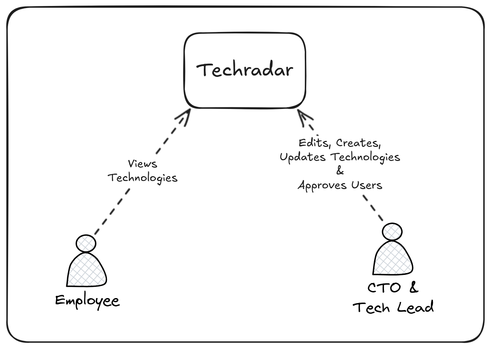
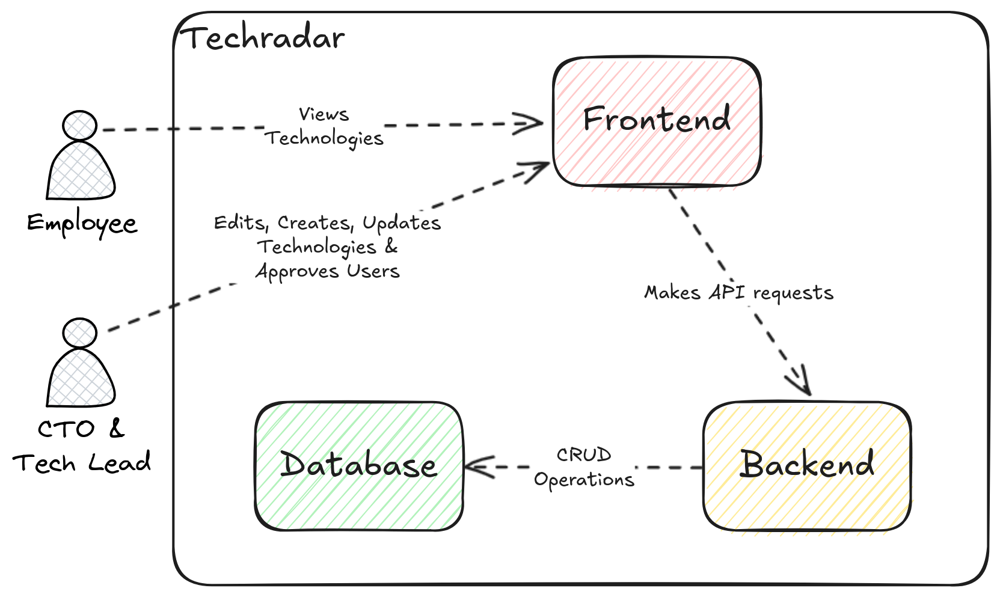
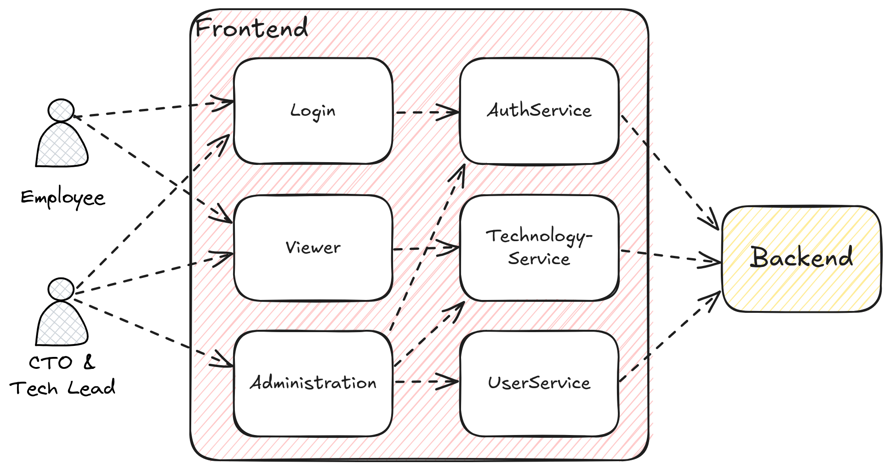
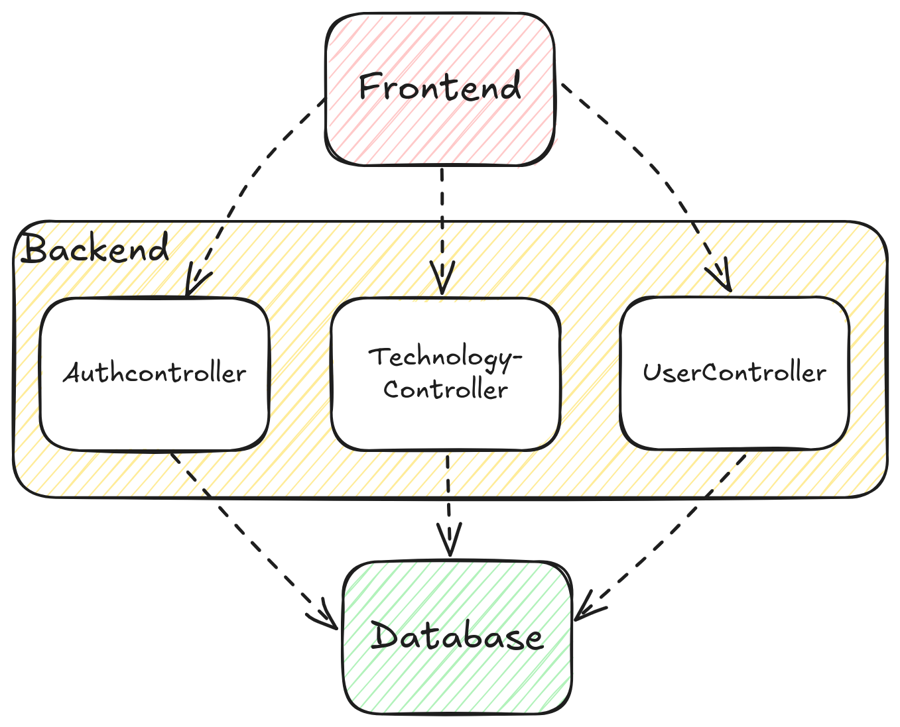

# Architecture Documentation (arc42)

## 1. Introduction and Goals

### 1.1 Requirements Overview

The Technology Radar is a SaaS application designed to help organizations track and evaluate emerging technologies. It is composed of:

- **Technology Radar Administration**: Managed by CTOs and Tech-Leads to add, edit, and publish technologies.
- **Technology Radar Viewer**: Provides employees access to view published technologies.

Project descriptions and exact requirements can be found here:

[https://github.com/web-programming-lab/web-programming-lab-projekt/blob/main/Technologie-Radar.md](https://github.com/web-programming-lab/web-programming-lab-projekt/blob/main/Technologie-Radar.md)

### 1.2 Quality Goals

- **Usability**: Intuitive UI for both administration and viewing.
- **Performance**: Viewer should load in under 1 second.
- **Security**: Authentication and logging of role-based access control.

### 1.3 Stakeholders

- **CTOs & Tech-Leads**: Responsible for managing technologies.
- **Employees**: Access to view published technologies.

## 2. Architecture Constraints

- **Tech Stack**: MEAN stack (MongoDB, Express.js, Angular, Node.js)
- **Authentication**: JWT-based authentication
- **Hosting**: Cloud or on-premise deployment
- **Logging**: All admin logins must be recorded

## 3. Context and Scope

### 3.1 Business Context

The system allows organizations to track and categorize technologies based on adoption maturity.

**Actors & Interactions:**

- **CTOs & Tech-Leads** manage technologies.
- **Employees** view published technologies.

### 3.2 Technical Context

- **Frontend**: Angular UI with Material UI and TailwindCSS
- **Backend**: Express.js
- **Database**: MongoDB

## 4. Solution Strategy

The Technology Radar is developed as a SaaS application using a MEAN stack. The system consists of two primary components:

- **Technology Radar Administration** (for managing technologies, accessible by CTOs and Tech-Leads)
- **Technology Radar Viewer** (for employees to view published technologies)

Security measures such as authentication, role-based access control, and audit logging for admin access are implemented.

## 5. Building Block View

### System Components

1. **Frontend**

   - Angular-based UI
   - Material UI and tailwindCSS for styling
   - Responsive design for desktop and mobile

2. **Backend**
   - Express.js with TypeScript
   - Authentication with JWT
   - RESTful API for data management
3. **Database**
   - MongoDB as the data store
   - Database: `techradardb`
   - Collections: `users`, `technologies`, `categories`, `rings`, `loginlogs`,

### Level 1

### Level 2

### Level 3 Frontend

### Level 3 Backend

## 6. Runtime View

### User Login (Administration & Viewer)

1. User submits credentials (email, password).
2. Backend verifies credentials and role-based access.
3. If valid, a JWT is issued, stored in localstorage and used for subsequent requests.

### Technology Management (Administration)

1. CTO/Tech-Lead creates a new technology.
2. The system validates required fields and stores the entry.
3. Technology description can be updated.

   `name`, `category`, `description` are required fields

4. Technology maturity can be updated.

   `ring`, `justification` are required fields

5. Technologiy can be marked as drafts during creation. Where `ring` and `justification` become optional fields.
6. Technology can be published, Where `ring` and `justification` become required fields.

### Technology Display (Viewer)

1. Employees access the Viewer UI.
2. The frontend retrieves only published technologies via API.
3. Technologies are displayed in a table.
4. The table can be sorted by category and ring.
5. The table can be filtered by technology name (search field).

## 7. Deployment View

- **Docker-based deployment**
- Backend, Frontend, and Database run in separate containers.
- Containers are connected to each other via docker network.
- Reverse proxy (Nginx) for serving frontend.
- Hosted on a cloud provider or on-premise server.

## 8. Cross-cutting Concepts

- **Authentication & Authorization**: JWT-based authentication with role-based access control.
- **Logging & Monitoring**: All logins are logged.
- **Performance Optimization**: The Viewer is optimized for a loading time under 1s.
- **Security Measures**: Secure password storage, and restricted API endpoints.

## 9. Architecture Decisions

| Decision                        | Rationale                                                                      |
| ------------------------------- | ------------------------------------------------------------------------------ |
| Use MEAN stack                  | Leverages full-stack JavaScript/TypeScript for consistency and efficiency.     |
| Store technologies in MongoDB   | Flexible schema supports evolving technology attributes.                       |
| Use JWT for authentication      | Stateless authentication is scalable and secure.                               |
| Use Material UI and TailwindCSS | Provides a exhausting list of pre styled components and utility-first styling. |

## 10. Quality Requirements

- **Usability**: The UI must be responsive and intuitive.
- **Performance**: The Viewer must load in under 1 second.
- **Security**: Admin logins are logged, and sensitive operations require authentication.

## 11. Risks and Technical Debt

- **Scalability**: Handling large numbers of companies and technologies may require database optimizations.
- **Authentication**: JWT security risks if tokens are not properly handled.
- **Frontend Performance**: Large datasets may impact UI responsiveness.

## 12. Glossary

| Term       | Definition                                        |
| ---------- | ------------------------------------------------- |
| JWT        | JSON Web Token used for authentication            |
| MEAN       | MongoDB, Express.js, Angular, Node.js             |
| SaaS       | Software as a Service                             |
| Tech-Radar | A tool for tracking and categorizing technologies |
